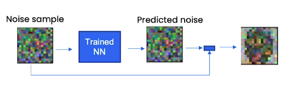
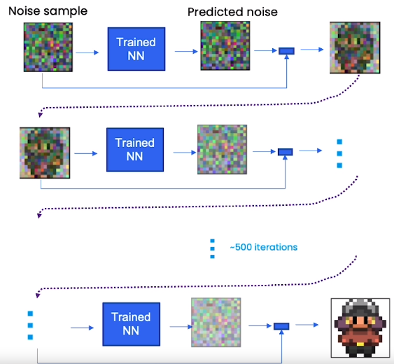
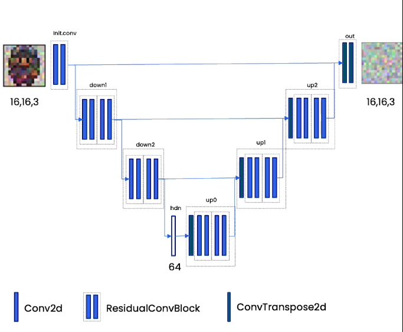
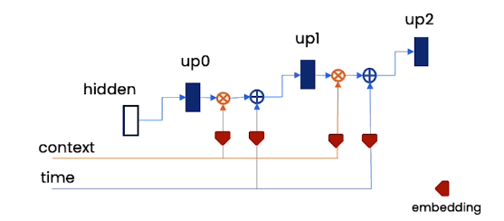
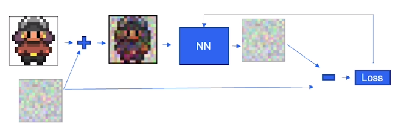

# Diffusion model

## Table of Contents
- [Sampling](#Sampling)
- [Neural Network](#Neural-Network)
- [Training](#Training)
- [Controling](#Controling)
- [Speeding up](#Speeding-up)
- [Reference](#Reference)

## Sampeling

We put the noise sample through our trained neural network that has understood what a sprite kind of looks like and what it does is it predicts noise. It predicts noise as opposed to the sprite and then we subtract that predicted noise from the noise sample to get something a little bit more sprite-like. 
  
  
  
Now realistically that is just a prediction of noise and it doesn't fully remove all the noise so you need multiple steps to get high quality samples. That's after 500 iterations we're able to get something that looks very sprite-like.

  

## Neural Network

The neural network architecture that we use for diffusion models is a UNet. The most important thing that we need to know about a UNet is that it is taking as input this image, and it's producing as output something of the same size as that image which is so special.  
  
  
  
And what it does is it first embeds information about this input, so it down-samples with a lot of convolutional layers, into an embedding that compresses all that information into a small amount of space. And then it up-samples with the same number of up-sampling blocks into the output back out for its task.  
  
What's also great about this UNet is that it can take in additional information. So it's compressed that image to understand what's going on, but it can also take in more information. One thing that's really important for these models is the time embedding. So this is an embedding that kind of tells the model what the time step is, and therefore what kind of noise level we need. All you have to do for this time embedding is you embed it into some kind of vector, and you can add it into these up-sampling blocks.  
   
Another piece of information that could be useful is a context embedding. Context embedding does is it helps you control what the model generates. 
  

  
## Training  
  
Here the qustion is, how we train this UNet neural network and get it to predict noise?  
we take a sprite from our training data, and we actually add noise to it. Then we give it to the neural network, and we ask the neural network to predict that noise. Following that we compare the predicted noise against the actual noise that was added to that image, and that's how we compute the loss. And that backprops through the neural network, so then the neural network learns to predict that noise better.  
  

## Controling

## Speeding up

## Refrence
My sincere thanks go to Andrew Ng, Sharon Zhou, and Deeplearning.AI for their valuable content. This repository serves as a supplementary resource for better understanding. For more in-depth details, you can refer to [Deeplearning.AI](https://learn.deeplearning.ai/diffusion-models/lesson/1/introduction).
